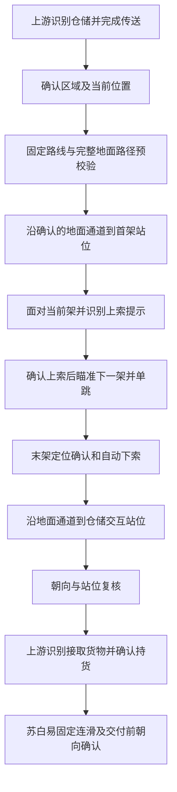

# 固定取货滑索与朝向改造调研方案

2026-09-15。博士要求在苏白易真实送货闭环验收前，先调研旧版固定取货滑索，以及取货点、交付点、滑索架的两点朝向机制。本文是源码调研和待审阅方案，不代表功能已经实现或实机通过。

## 1. 结论与范围

建议先补完“武陵城固定取货单跳 + 两端受约束地面路径 + 交互前朝向确认”，再接回苏白易已通过的连滑送货路线，最后执行真实取货和交付。试验园区沿用相同设计，按原计划后置。

- 固定取货段有必要恢复。仅开启自动滑索不能保证采用指定两架；仅固定两架也不能保证首尾地面路径避开设施。
- 两点朝向机制值得保留，新版已经有对应底座。重点是接入正确对象、区分站位与朝向点，并补足朝向未确认时仍报告完成的边界。
- 滑索架分两种朝向：地面上索前面对当前架；架上发射前面对下一架。后者已有闭环，不再迁移旧 MapTracker。
- 先完成本方案涉及的独立移动／识别验收，再恢复真实订单；不重复要求苏白易原有正常连滑空跑来关闭已经修好的计数问题。

## 2. 调研基线与证据

| 对象 | 本轮依据 |
| --- | --- |
| 新版源码 | `df3186bb7aabc647331dc1a9631f1c15e6fbab43`，`codex/fixed-zipline-delivery` |
| 旧版源码 | 本地已存在的 `myfork/feature/zipline-fast`，`649ca85082acf5e85f95ddb4376793b0045f0d71` |
| 当前实机成果 | [苏白易连滑验收](./苏白易连滑实机验收记录.md)：16 架／15 跳、首跳后 14 次 E、末架及终点通过 |
| 本机程序 | C++ SHA256 `C6A7C8956D9A9F1D4362CF8CE27D920D4AA67E11023D46A5B68934ADAA9FEB44`，与已验收记录一致 |
| 远端核对 | 本轮 fetch 因网络超时失败；以上旧版结论固定到已存在的提交，不声称已获得远端最新修改 |

本轮只读取旧分支对象，不切换或修改旧工作区。旧坐标仅用作定位历史意图的线索，不能未经当前地图与账号设施核验就写入新版可执行配置。

### 2.1 旧版固定取货确实使用滑索

旧版 [SeizeDeliveryJobsPost.json](https://github.com/Hadrien-codeur/MaaEnd/blob/649ca85082acf5e85f95ddb4376793b0045f0d71/assets/resource/pipeline/SeizeDeliveryJobs/SeizeDeliveryJobsPost.json) 的相关节点：

| 路线 | 旧版实际结构 | 朝向实际配置 |
| --- | --- | --- |
| 武陵城 | `WulingCityWalkToZipline` → `WulingCityZipline` → `WulingCityWalkFromZipline`，地面 NAVMESH＋单跳滑索＋地面 NAVMESH | 上索前与取货末端 HEADING 都是注释预留项，不能说此提交已经启用 |
| 试验园区 | `TestAreaWalkToZipline` → `TestAreaZipline` → `TestAreaWalkFromZipline`，旧注释记载单跳跨度 38.11m | 上索前有 HEADING；取货末端仍是预留项 |

上述名称均有 `SeizeDeliveryJobs` 前缀。旧版归档将这两条取货线标为已测通；这属于历史证据，不是新版验收。

武陵城历史地面点包括架前 `[949.74, 1777.67]` 和取货站位 `[951.98, 1832.68]`，属于旧 base 坐标；滑索动作的 `[682.9, 785.25]` 属于旧 MapTracker 坐标。**两者不能直接混算朝向，也不能拿这个 MapTracker 点当新版设施世界坐标。** 新版需要确认两座架子的完整世界三维位置及对应地图／Level／模板。

### 2.2 旧版朝向的价值及限制

旧版 [送货路线文件](https://github.com/Hadrien-codeur/MaaEnd/blob/649ca85082acf5e85f95ddb4376793b0045f0d71/assets/resource/pipeline/SeizeDeliveryJobs/SeizeDeliveryJobsDeliverRoutes.json) 确有实际使用：

- 公共送货上索段：站位 `[960.78, 1830.32]`，朝向点 `[962.35, 1828.69]`。
- 苏白易（`TechProductionOffice`）交付段：站位 `[539.42, 1250.45]`，朝向点 `[538.23, 1251.04]`，旧注释记为约 243°／1.34m。
- 试验园区取货上索段：站位到架体约 1.20m，并明确记载近距离抖动风险。

旧版 [归档 §5.1～5.3](https://github.com/Hadrien-codeur/MaaEnd/blob/649ca85082acf5e85f95ddb4376793b0045f0d71/docs/zh_cn/developers/tasks/seize-delivery-jobs-zipline-archive.md) 区分了站位和面向对象，也记录了把发射目标误写成当前架导致失败的案例。旧“至少 2m”、定位抖动约 0.7m 和 40° 容差是当时经验；代码中存在小于 2m 的已用点，不能将经验门槛当作所有历史路线严格满足的规则。

### 2.3 新版已有能力与缺口

| 范围 | 源码证据 | 对本次方案的影响 |
| --- | --- | --- |
| 武陵城取货 | `tools/pipeline-generate/AutoDelivery/routes.json` 的 `domain_2_lv002_depot_1` 已有过桥路径覆盖，并注明桥面网格缺失 | 新版并非只有一个自动寻路终点；固定取货应新增独立变体，保留原上游绕行 |
| 固定配置 | `assets/data/MapNavigator/fixed_zipline_routes.json` 当前只有苏白易 | 取货两架尚未注册，不能认为从苏白易起点反推即可 |
| 首尾地面段 | `zipline_leg_planner.cpp` 的 `approach_cache`／`departure_cache` 各自调用 `PlanNavmeshRoute` | 当前固定的是架序，尚未固定地面安全通道 |
| 路径边界 | `navmesh_path_expander.cpp` 固定分支只允许无必经动作的 NAVMESH／RUN，最终以 `param.path.back()` 为目标 | 不能直接添加 HEADING 或 `required`；现有中间移动提示也不保证逐个执行 |
| 两点算角 | `navi_math.cpp:9`，`CalcTargetRotation` 使用 `atan2(dx, -dy)`，归一化并取整到度 | 已有北为 0°、东为 90°的计算，无需新建 Go 算法 |
| 普通 HEADING | `semantic_nodes.cpp:278` 起，支持实际当前位置→目标点或固定角度 | 已能发转向并读反馈，但不等于严格朝向断言 |
| 普通朝向完成 | `VerifyAndCorrectHeading`；`navi_config.h` 中容差 40°，最多 3 次修正 | 无稳定反馈、修正耗尽或后续转向失败时可返回角度，调用方仍推进节点，严格业务需补结果状态 |
| 地面转向位移 | `CommitHeadingTurn` 使用 `PulseForwardSync`，已经对齐的分支也有前进脉冲 | 不能称 HEADING 完全无位移；必须复核站位，避免挤进设备或绕过目标 |
| 发射闭环 | `zipline_action.cpp:240` 起的 `AimAtLanding` 逐步算目标方向、读稳定反馈；失败不发射 | 直接保留；俯仰仍是独立的高度计算与开环调整，水平 heading 不能替代它 |
| 上索干扰 | `MountStandPoint` 计算避开邻近供电结构的备用站位；运行期有提示预筛及移位处理 | 已有局部抗干扰措施，但不是全部地面设备的可通行保证；朝向也不能单独解决最近设备抢提示 |
| 业务生成 | `model.mjs` 生成仓储／回收站的 yaw 正面 8m 接近点，未自动生成交互 HEADING | yaw 用于接近侧，不能直接当玩家面对目标的 heading；从正面接近时通常需要反向面对目标 |
| 分发 | `navigation.go` 当前读取 `attach.zip`；两个 resolver 选择普通或 WithZipline 节点 | 固定业务选择仍需补齐；不能把“允许自动滑索”永久等同于“启用个人固定路线” |

技能提示导航过程中应在移动中转向；当前专用 HEADING 实际采用转镜头＋前进脉冲，架上瞄准则只转镜头。三者状态不同，方案保留这种区别，不新增“完全静止等待角色朝向变化”的控制循环。

## 3. 固定取货改造方案

### 3.1 推荐结构

武陵城取货单独配置完整两架有向链，按规则一跳、一次左键、零次 E。取货末架与送货首架即使相近，也要分别验证接货后站位及接近路线；不假定二者为同一架，不自动把取货与送货合成连续滑索段。

### 3.2 路径表达与实现边界

推荐在现有原生固定规划器中补足地面约束和末端朝向支持，继续使用一个 `MapNavigateAction` 执行完整移动。这样完整架序、地面可达性和错误配置仍可在第一步移动前检查；无需在 Pipeline 中复制一套上索、下索控制。

下列字段是**拟议设计，当前尚不支持**；实施时同步 Schema、数据校验和工具，不先填入运行资源：

| 层 | 拟议变化 | 明确语义 |
| --- | --- | --- |
| 固定架序配置 | 可选 `approach_path` | 当前有效定位开始，依次经地面必经点到实测首架站位；不填时保留当前自动接近 |
| 固定架序配置 | 可选 `departure_path` | 从已确认末架下索后的接地段开始，依次经避障点离开设施区域，再接请求终点；不填时保留当前自动离开 |
| 固定导航请求 | 支持末尾一个 HEADING | 把最后移动点与面向对象分开；固定链规划只取最后移动点作为目标，HEADING 必须保留并在地面到达后执行 |
| 上索执行 | 配置了首架站位时按实际位置面对首架 | 朝向目标从唯一匹配的当前架取得；站位来自实测接近段，不能要求人先走到架中心再计算零距离朝向 |

地面路径采用已有 NAVMESH／RUN 点语义，声明正确 `target_tier`，重叠面使用实测 `target_deck_y`；首版不接受地面段内的交互、过图或嵌套滑索。路线中列出的安全通道点按顺序保留，NAVMESH 只规划相邻约束点之间的路，不能用全局直达优化跳过。RUN 点只用于已核验的局部通道，不能承诺它自动避开新摆放的设备。

首架站位需要验证在同层、可达且处于有效上索范围。由站位衔接 ZIPLINE 航点，不在朝向之后再悄悄插入走向架中心的移动。上索提示预筛可以继续工作，但严格朝向路线的提前上索出口也必须经过朝向／站位检查；检查后重新识别提示，不能消费转向前的旧截图。备用站位一旦启用，要重新计算朝向，失败按阶段停止。

末架位置确认、自动下索沿用现有实现；地面路径第一段必须落在可走面并有实机接地证据，不能把设施顶部世界高度直接当作仓储地面高度。

原始固定调用中已有的多点移动提示继续保持兼容，不能突然把历史提示解释为新的首架接近段。新业务变体应生成明确的最终站位＋可选 HEADING；安全地面段在专门的配置中维护，避免含糊推断哪一个点在上索前或下索后。

### 3.3 为什么不只改两个节点

| 选择 | 评估 |
| --- | --- |
| 只加取货固定 ID 和末尾 HEADING | 当前会拒绝 HEADING，且地面路径仍可能走进设施；不足以满足需求 |
| Pipeline 拆成接近、固定移动、最终朝向三次调用 | 末端独立朝向适合作为调试入口，但首段移动先于完整固定路线验证，且固定调用会再自动接近首架；不作为正式总方案 |
| 扩展当前固定规划的地面约束＋严格朝向 | 推荐；完整计划预校验、保留架序控制、一次导航完成，不引入订单业务状态到 C++ |

玩家设施不保证都存在于静态 navmesh 中。固定滑索减少穿越设备密集地面的机会，地面必经点减少误选通道；更新设施后仍要复核通道。现有虚拟禁区／设备探测保留在其已支持边界内，不宣称 heading 或固定链能解决任意动态障碍。

## 4. 两点朝向与精度改进

### 4.1 三种目标必须分开

| 阶段 | 站位 P | 朝向对象 T | 最终成功证据 |
| --- | --- | --- | --- |
| 地面上索 | 架前可交互站位 | 当前架有效交互方向 | 朝向／位置通过，识别正确上索提示，上架状态确认 |
| 架上发射 | 架上最新有效定位 | 下一架投影坐标 | 现有水平闭环与俯仰控制，再确认滑行／落架 |
| 仓储取货／NPC 交付 | 对应目标的交互站位 | 仓储／NPC 本体或同方向实测参照 | 朝向／位置通过，匹配正确按钮，确认货物状态或交付结果 |

设施导入坐标可能是角格锚点，不等于可交互中心。几何匹配、地图投影和朝向参照要分别验证；不要假定森空岛锚点就是最精确的面对目标。

### 4.2 两点公式与近距离策略

同一 base 平面下使用现有公式：`heading = normalize360(atan2(T.x - P.x, -(T.y - P.y)) * 180 / π)`。位置 P 来自最新有效 MapLocator，T 来自经过核验的目标数据。tier 坐标先按已有仿射变换统一；世界 x/z、base x/y、屏幕坐标不能混算。发射仰角继续用世界水平距离和高度差。

优先使用实际位置到对象的动态方向，能补偿站位误差。两个点相同或距离不足以分辨方向时，必须拒绝把算出的数值当有效 heading。

近目标时可采用经实测的 P0→T0 方向作为固定角度（已有 `HEADING.angle`），或保存同方向远参照；但应先确认人仍在 P0 的交互站位区域内。将 T0 从 P0 向外延长仅降低运行期位置噪声对算角的影响，**不能提高原始 P0/T0 的测量精度，也不能保证人在偏离站位后仍正对真实对象**。

距离门槛由本机观测误差决定。可用垂直方向误差与距离之比估算小误差下的角度敏感度 `δθ ≈ σ⊥ / d`（弧度）；这只是采点辅助，不是确定性成功界限。先记录当前定位散布、目标参照误差与按钮可见角域，再定容差，不直接照搬旧 2m 或全局收紧到任意数值。

### 4.3 让“已对准”成为可检验结果

建议在已有 HEADING 点上增加一个可选、仅明确配置时启用的严格角度容差字段（拟名 `heading_tolerance`，单位度，范围大于 0 且不超过 180）。它同时表示必须获取有效反馈并满足该容差；不另加一套业务朝向 Custom，也不全局改写所有上游路线的 40° 行为。

内部返回明确结果：已确认／无有效反馈／超出容差／输入失败／用户取消。新严格路径仅在“已确认”时推进。现有默认路线兼容性与日志需要单独回归；业务线路先用测得的容差，不能通过扩大容差消除失败。

转向采用反馈驱动的小步修正，实际地面位移后重新计算 P→T；只在目标位置与朝向都有新鲜、非保持且未遮挡的观测时认定成功。取消检查覆盖每次输入前后，不等待整轮修正结束才处理。存在期限是为终止无进展动作，不新增“失败后重跑整单”的重试。

地面 HEADING 有前进脉冲，朝向通过后还须检查相对原交互站位的位移、地图与层级。应从安全的接近方向进入目标可交互区域；若已经越过对象、离开区域或反馈缺失，停止并记录，不能继续盲按交互。该复核复用导航的真实位置结果和区域断言；`MapLocateAssertLocation` 负责区域，不能冒充角度断言。

上索前的严格朝向复用同一结果逻辑，但只在地面调用；架上不得套用地面前进脉冲。连续滑索途中仍仅消费提示与计数，不增加逐架定位或 HEADING。

### 4.4 业务与生成接入

独立固定取货入口绑定 `domain_2_lv002_depot_1`，固定送货入口绑定苏白易 `deliver_target_map02_lv002_01`。通过共享 AutoDelivery 的 ID 分发接入抢单与装箱自送；保留识别任务详情、传送、取消追踪、取货和提交。

普通、自动滑索和个人固定路线应有明确区分，既有 WithZipline 不再隐含个人固定覆盖。生成源新增独立固定变体和对应目录引用，原有 `path`／`retry_path`／`departure_path` 保持其上游语义。**仓储公共 `departure_path` 不得再重复拼入固定送货的地面接近配置。** 固定取货地面路径也不能覆盖装箱任务的普通仓储移动。

未配置目标按原计划跟随上游；数据损坏明确报错。已开始固定段失败就停止，不回起点重跑；修正交互站位只允许已有且经过核验的局部路径，固定导航失败不能进入该修正出口。功能关闭／全局禁滑的业务分流与严格测试入口行为分别验证。已取货恢复由上游跳过取货阶段，不能因为新增取货固定 ID 就强行再跑一遍。

## 5. 实施次序与验收

| 顺序 | 工作 | 进入下一步的证据 |
| --- | --- | --- |
| A：资料核验 | 读取当前账号设施，用地图工具确认武陵城取货两架、传送后通道、架前站位、末架接地段、仓储及苏白易 P/T | 两架唯一匹配，坐标系／层级明确，所需截图与方向证据齐全 |
| B：导航改造 | 固定首尾地面约束、末尾 HEADING、上索前朝向入口、严格结果与取消处理，补 Schema／工具 | 离线反例与 C++ 编译通过；旧苏白易配置仍有 15 跳／14 次 E |
| C：无订单实机 | 固定取货单跳走到仓储即停；分别从仓储站位和苏白易站位测试朝向与按钮识别 | 避开设备、正确两架、上索及下索通过；站位和方向有效，未误认邻近设备；不执行真实取货／交付 |
| D：业务接线 | 固定变体、双入口选项及文案、已有委托与持货状态分流 | 生成器／分发／失败出口验证通过 |
| E：恢复原第 2 步 | 未取货→固定取货→苏白易固定连滑→交付→返回调用方 | 真实货物状态和成功出口证据，随后补双入口／恢复矩阵 |

C 阶段先验证两个新增局部能力；苏白易整段只在集成需要或发现回归时复测，不把旧计数问题重新列为待验收。P0 上游步行／自动滑索对照和异常矩阵仍保留，在同设置下记录，不用软件检查替代。

### 5.1 必须补齐的材料

1. 当前账号取货首架和末架的世界 x/y/z、地图、Level、模板、供电与实际连接；在当前快照中完成唯一匹配。不能用旧 MapTracker 的目标值填缺失架。
2. 传送落点到架前、下索到仓储的当前安全路线，含桥面／设备边缘／重叠面的说明。用工具确认哪几个点必须经过。
3. 仓储、苏白易、取货首架的站位 P 与朝向对象 T，以及相应层级。当前苏白易移动终点 `[538.031, 1250.27]` 不能直接等同于旧 `[539.42, 1250.45]` 的交互站位。
4. 各站位的目标交互提示、转向前后、上索和下索状态画面。复用现有模板时确认适用；新增模板／ROI 必须有 1280×720 证据，测试图按技能脱敏。

这些是后续实现和实机验收的材料门槛，不影响本轮调研方案交付；本轮不生成带猜测坐标的 Pipeline。

### 5.2 自动化验证与日志

| 验证范围 | 核心用例 |
| --- | --- |
| 固定取货规划 | 两架单跳零 E；设施缺失／歧义／错层／反向；地面约束完整保留；默认路径兼容；坏配置在输入前失败 |
| 规划与朝向衔接 | 最后移动点不被 HEADING.target 替代；首架站位不被架中心覆盖；提前上索不绕过严格朝向；失败不执行后续交互 |
| 两点方向 | 四象限、359°／1°环绕、同点／近点、base／tier 转换、静态角度与动态目标、目标面错误 |
| 反馈与位移 | 持续超差、定位保持／遮挡、输入失败、脉冲离开站位、移位后重算、取消后重启清空状态 |
| 已有滑索 | 苏白易 15 跳／14 次 E、两架零次 E、末架复核保留、途中不请求定位、默认自动滑索不受影响 |
| 业务生成 | 固定变体独立；公共离场前缀不重复；重新生成不丢字段；普通路径／全局禁滑／持货恢复／失败不继续装箱 |

日志至少区分 `source_id`、固定路线 ID、阶段、坐标系／层级、P/T、距离、目标角／实测角／残差、定位有效性、站位位移、是否启用备用站位、交互匹配及失败原因。到达、朝向通过、交互成功分别记录。

实现阶段执行局部 C++／规划／生成器测试与编译、`pnpm format`、`pnpm format:go`、`pnpm check`、`pnpm test` 和既定 Schema 检查；头文件变更按本机约定 clean 后重建。检查范围及命令沿用 [固定路线开发与验证](../../../tools/fixed-delivery/README.md)。本轮只有文档，执行 Markdown 和链接／差异检查，不声称执行以上代码测试。

## 6. 预计修改位置

| 范围 | 预期改动 |
| --- | --- |
| `assets/data/MapNavigator/fixed_zipline_routes.json`、`tools/schema/components/fixed_zipline.schema.json` | 新增实测取货链、可选地面约束及数据校验 |
| `fixed_zipline_route.h`、`zipline_leg_planner.cpp`、`navmesh_path_expander.cpp` | 地面段与完整架序预展开，保留末尾朝向，明确首架站位与目标面 |
| `navi_param_parser.cpp`、`navi_domain_types.h`、`semantic_nodes.cpp`、对应 Custom Schema | HEADING 严格结果和可选容差，站位／取消边界 |
| `zipline_action.cpp`、`navigation_state_machine.cpp`、运行状态 | 地面上索前确认及提前提示入口接线，架上闭环保留 |
| AutoDelivery 生成源、目录与 Go resolver | 仓储／终点固定变体及选项分发，保留上游业务生命周期 |
| `assets/tasks/SeizeDeliveryJobs.json`、DeliveryJobs 生成源、五语言文案 | 双入口统一选择固定路线与连滑模式 |
| `tools/fixed-delivery`、MapNavigator 工具、相应测试 | 地面约束与朝向可检查／可预览，未支持的编辑往返明确拒绝，不丢参数 |

下一次实施从 A 开始；若现有本机设施与采点资料已经足够，先自行核验，只向博士索取确实缺少的实机材料。本文方案先供博士审阅，不因已有提交授权就把拟议参数写入业务代码。
