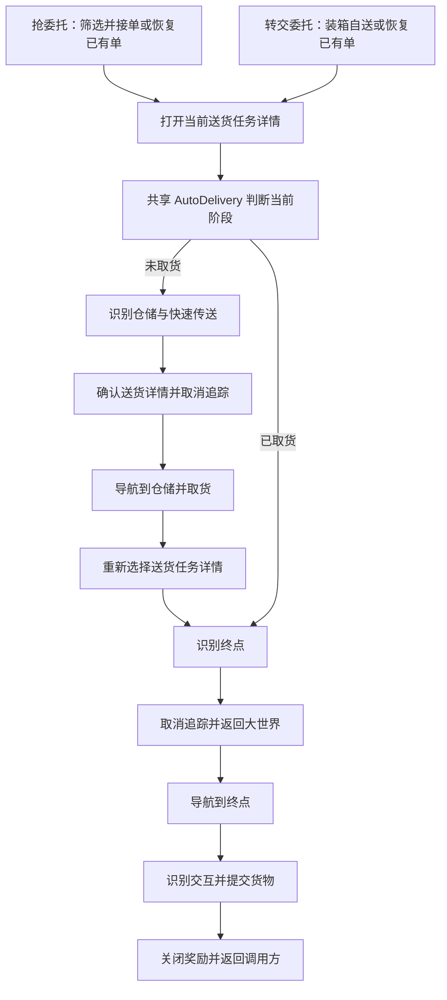
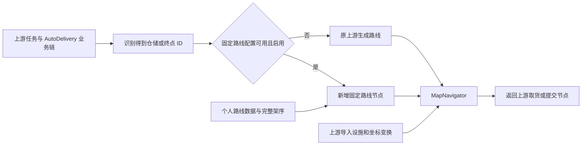

# 新版固定滑索自动送货：调研与开发计划

> 调研日期：2026-09-07。用户于 2026-09-08 确认启动独立新版开发；当前进度见接力记录。
> 本文技术调研固定于 2026-09-07，不将历史结论自动视作当前实测结果。新版基线与增量变化记录在接力文档。
> 目标：在最新上游送货能力上恢复指定滑索路线取货、送货，并补回途中按 E 连滑。
> 本轮只读取代码、同步远端引用并编写文档；未切换工作分支、修改业务代码、提交或推送。
> 新会话先读：[新版固定滑索送货接力记录](./新版固定滑索送货接力记录.md)，其中保存了最新授权状态、环境检查和启动步骤。

## 1. 建议采用的方案

**从最新上游建立独立开发基线，复用共享 `AutoDelivery`、森空岛滑索导入和 C++ `MapNavigator`，只补“按指定顺序选滑索架”和“途中连续接力”两项能力。**

不要将旧 `feature/zipline-fast` 整体合并进新基线，也不恢复 `MapTracker` 包。旧代码最有价值的是实测路线、分段方式、失败经验和测试入口设计；它的任务详情跳转、蓝标分流和定位底座已经被上游替代。

建议依次交付：

1. 在同一版本上建立上游步行、上游自动滑索两组实机基线。
2. 整理武陵城路线，用上游现有的“到架后重新发射”方式验证指定架序。
3. 在已经确认的架序上增加途中按 E 连滑，先短链、再长链、最后分段链。
4. 接入抢委托与装箱自送两个入口，完成武陵城验收。
5. 迁移试验园区；四号谷地继续使用上游流程，固定路线另行录制。

这是一项需要少量 Go 接线、路线数据维护和 C++ 导航扩展的工作，**不能仅靠打开 `zip: true` 或替换几个旧节点完成**。

## 2. 调研基线与证据边界

### 2.1 实际核对的版本

| 来源 | 核对版本 | 含义 |
| --- | --- | --- |
| 上游 `origin/v2` | `cc3b79c9cbc156ee30cf9ea6e3dbb594551750db` | 本次 fetch 后的上游最新提交；也对应已获取的 `v2.28.0-beta.2` 标签 |
| 上游正式版标签 | `v2.27.0` → `027d1386ef774237ce852ee2c269847ecd9f7d23` | 可用于正式版对照；本文接口分析以以上 `v2` 提交为准 |
| 个人远端 `feature/zipline-fast` | `649ca85082acf5e85f95ddb4376793b0045f0d71` | 2026-09-02 提交，内含 2026-09-01 冻结归档 |
| 当前本地 `feature/zipline-fast` | `abdfd5cd` | 落后上述个人远端 **9 个提交**，仍是 08-06 调研状态 |
| 个人远端 `feature/self-deliver-route` | `b1fccddd67c479eaa292d0fa6e04c1fadd4b8038` | 早期自送探索分支，不能当成已完成的滑索方案 |
| 个人远端 `v2` | `ca33e2d4` | 仍停在 08-04；不能用它作为“最新上游” |

上游本次基线的模型子模块为 `746e0854`，测试集为 `c800a4ef`，MaaUtils 为 `5e43bbe3`。后续测试必须同时记录主仓库、子模块、MaaFramework 和两个 Agent 的实际版本。

已读取两条个人分支的 `CLAUDE.md`、最新滑索归档、路线录制规范、试验园区清单、本地《送货步行段迁移 NAVMESH 方案》，并对照了对应 Pipeline、Go 与 C++ 实现。

**事实等级：** 本文“已实现”指源码中存在；旧路线“已测通”来自个人远端归档和修复提交，不代表本轮重新跑过游戏。当前游戏设施、账号滑索快照和新版端到端成功率尚未实测。

GitHub 公共 API 本轮触发限流，未据此判断开放 PR 的状态或最新 Release 页面；版本结论来自成功更新的 Git 提交和标签。本文的来源链接固定到提交，避免后续上游更新改变证据。

### 2.2 需要替换的旧认识

| 旧文档中的判断 | 本次核实结果 |
| --- | --- |
| MapNavigator 没有滑索，迁移必须保留 MapTracker | 已过时：上游已实现导入、规划、上下索与多跳，且删除了 `agent/go-service/maptracker` |
| 试验园区四条路线仅写完、尚待测试 | 远端后来修复了首跳目标及连滑计数，归档标为可用 |
| 源石研究园可以作为下一批路线直接接着做 | 远端已经决定放弃；保留代码存在坐标及参数问题 |
| 转交委托自送仍需借用抢单任务的整套后处理 | 上游已有任务无关的共享 `AutoDelivery` |
| `pipeline_override` 能保证不与上游冲突 | 只能减少文本冲突；公共节点语义变动仍会造成行为冲突，旧版取消追踪卡死就是实例 |
| 旧工具入口和控制器名称可以沿用 | 上游已采用 `uv run map-navigator` / `uv run build-and-install`；Linux 控制器名称也已变化 |

## 3. 上游送货能力与任务流程

### 3.1 两个任务共享一个送货组件

`SeizeDeliveryJobs` 负责抢单、价格下限、出发地/终点筛选及循环次数；接到单或发现已有委托后进入适配层。后处理可以选择仅传送、走到仓储或完整送货。

`DeliveryJobs` 负责各仓储节点的装箱和接单策略。当前提供接取并转交、全自动送货、按报价处理、仅接取、仅装箱、不处理等方式；它已经支持自己装箱后的自动送货和已有委托恢复。成功后返回仓储循环，失败时停止，避免继续装箱。

两个任务都通过公共入口 `AutoDelivery` 执行取送货，入口前由调用方打开正确的当前任务详情。[S1]、[S2]



**新版应完整保留这条业务链。** 尤其不要恢复旧版在多个阶段重写 `SeizeDeliveryJobsEnterDestinationMap.next` 的做法。

### 3.2 终点选择已从蓝标近邻转为目录匹配

上游读取任务详情的区域、买家/任务文本，经 `agent/go-service/autodelivery/` 匹配目录，再选择生成路线节点：

- 仓储使用稳定的 `domain_..._depot_...` ID。
- 终点使用稳定的 `deliver_target_...` ID。
- NPC 按区域和目的地文本匹配。
- 资源回收站按完整任务文本及区域匹配；存在多个候选时通过地图 `MapFind` 进一步确认，不静默取最近的一个。
- Go 只选择节点名，实际坐标与路径留在生成 Pipeline。[S3]

本次目录包含 **5 个仓储、22 个终点**。新版应在这一步得到明确 ID 后选固定路线，保留“命中自定义路线就使用、没有就跟随上游”的思想，**舍弃旧蓝标半径 30 的分流实现**。

### 3.3 路线的维护入口与运行时分发

| 层次 | 当前上游文件/职责 |
| --- | --- |
| 游戏源数据 | `tools/pipeline-generate/data/delivery_destinations.json`：ID、名称、区域、坐标、yaw |
| 人工覆盖 | `tools/pipeline-generate/AutoDelivery/routes.json`：按 `source_id` 保存特殊路线 |
| 生成路线 | `assets/resource/pipeline/AutoDelivery/Routes/*.json` |
| 运行时目录 | `assets/data/AutoDelivery/catalog.json`：名称、归属、普通/滑索/站位修正节点名 |
| 分发器 | `AutoDeliveryNavigateDepot`、`AutoDeliveryNavigateDestination` 等固定 `SubTask` 节点 |

人工覆盖支持 `path`、`retry_path`、`walk_only`，仓储额外支持公共 `departure_path`。默认仓储及回收站会从正面 8 米接近点靠近目标；NPC 主路线一般使用终点。主路结束后未出现交互时，上游允许一次专用站位修正，修正后仍失败则结束。[S4]

注意三项边界：

1. 上游 `departure_path` 会拼在该仓储所有终点路线之前。固定路线若已有独立“走到起点架”段，不应再无意叠加上游走桥/离场前缀。
2. 当前试验园区和供能高地**取货路线**有 `walk_only: true`，生成的 `WithZipline` 变体也会写 `zip: false`。这不是整个地图禁滑；终点路线有独立设置。不能简单取消取货的这个标记，已有绕行需保留到新路线实测替代。
3. `retry_path` 是特定站位修正，不是“失败再把全程跑一遍”。新版不扩大成业务重试循环。

### 3.4 实际滑索配置与文档存在差异

在本次提交中，代码实际读取：

- `AutoDeliveryNavigateDepot.attach.zip`
- `AutoDeliveryNavigateDestination.attach.zip`

两个任务的选项都覆盖以上字段；`navigation.go::parseNavigationOptions` 也只从 `attach` 解析。**`auto-delivery.md` 仍写覆盖 `AutoDeliveryRecognizeDepot/RecognizeDestination.custom_action_param`，这一段示例落后于代码，应以源码和任务配置为准。**[S5]

这也说明不能只阅读开发文档或沿用旧接线。实施时应先为真实读取位置建立针对性的验证。

## 4. 上游滑索能力、限制与可复用部分

### 4.1 导入的数据是什么

`ZiplineImport` 在 Windows 下打开内嵌 WebView2，读取用户登录后的森空岛/SKPORT 地图响应，提取滑索与供电结构标记，存入安装目录的 `debug/record/Ziplines.json`。它不是每次送货实时请求一次地图；设施变化后需要重新导入。[S6]

每条标记保留 `template_id`、`level_id` 和 `x/y/z`，其中 `x/z` 是水平面，`y` 是高度。`assets/data/MapNavigator/zipline_frames.json` 提供到 BaseNav 的仿射和高度变换。[S7]

**导入的是设施标记，不是经过验证的完整接线拓扑，也不是旧版预设路线。** 上游按同类架子、同层、三维跨度、占地范围、供电范围推断候选边。短距/长距架标称跨度分别为 80/110 米；几何可连仍不代表实际已连。边界供电和设施角格锚点也存在不确定性。

当前基线的存储按地图替换，未实现按游戏账号隔离。切号或在另一台电脑恢复环境时，必须核对导入来源和设施是否对应；不要使用数组序号充当稳定滑索架 ID。

### 4.2 自动规划如何使用滑索

`MapNavigateAction` 的 `zip: true` 允许规划器比较纯步行与滑索方案，包含：走到上索点、多跳滑索、末端走到目的地。纯步行不连通时，也能找滑索桥接两端可达区域。[S8]

有步行基线时，滑索需达到成本收益门槛；成本包括上索、换乘、滑行距离和两端步行。因此“允许滑索”不等于“强制滑索”，更不等于“走指定的架序”。

全局 `ZiplineRouting` 当前显示 `Auto`、`Never` 两项；`Always` 被隐藏，虽然 C++ 仍解析旧值。`Auto` 跟随任务请求，`Never` 禁滑。新版不依赖隐藏的 `Always`，也不通过修改全局成本来强迫全部任务走私人路线。

开启滑索规划后，中间作者点可能被跨过。`required: true` 用来保留必经点；它**不承诺坐某条索**。`HEADING` 等边界会保留，但向旧路径塞多个必经点仍不足以精确表达固定架序。

### 4.3 上游“多跳”和旧版“连滑”要分开

| 能力 | 上游当前状态 | 与我们的需求关系 |
| --- | --- | --- |
| 自动找上索点、匹配上索提示 | 已有 | 直接复用 |
| 架上稳定定位、闭环调整朝向、发射 | 已有 | 直接复用，舍弃旧 `MapTrackerToward` |
| 多跳滑索规划 | 已有 | 可以得到多架连续路线 |
| 中间架不下索，到架后重新瞄准和发射 | 已有 | 作为固定架序第一版的执行方式 |
| 飞行中看到提示按 E，直接接下一跳 | 导航器未接入 | 需要补充的连续接力能力 |
| 用户指定有序滑索架序列 | 未有完整公开参数契约 | 需要新增的固定路线能力 |
| 落地位置复核、错误落点处理 | 已有 | 保留并适配连续接力后的终点 |

证据：`StartZiplineHop` 发射一跳，`TickZiplineRide` 等目标落点稳定；若下一点仍是 `ZIPLINE`，保留架上状态，再处理下一跳。代码中的 `chain_continues` 指这种多跳，不能据此认定已有空中 E 接力。[S9]

`ZIPLINE` 虽已在 C++ 动作枚举中，但注释明确“只由滑索规划生成，不手写”。公开作者路径缺少它所需的完整落点信息。**不要把旧 JSON 直接改成 `action: ZIPLINE` 当作可用移植。**[S10]

上游保留了 `RealTimeAutoZipline`：模板识别后调用按 E 节点。它提供可复用的模板、ROI 和按键参考，但没有固定架序管理、去重、预期接力次数、最终落点校验。新版应复用识别资源并建立有明确出口的调用方式，不能将它无条件开启为与导航并行的后台连按功能。[S11]

### 4.4 上游仍在演进的相关分支

本次 fetch 发现以下提交尚不在所选 `origin/v2` 的提交历史中；以下仅是分支与代码差异观察，不宣称对应 PR 仍开放：

| 分支 | 已看到的方向 | 对新版的影响 |
| --- | --- | --- |
| `feat/zipline-account-uid` | 按账号隔离导入与选择规划账号 | 固定路线配置应预留账号/设施快照关联，避免再建一套不兼容的身份系统 |
| `fix/mapnavigator-zipline-mounted-replan` | 起滑失败后在架上重规划 | 修改滑索失败处理前重新核对，避免重复实现 |
| `feat/seizedelivery-mapfind-endpoints` | 抢单终点筛选改为 MapFind/生成器 | 不依赖旧终点筛选模板名作为固定路线主键 |

开工与每次合入上游前重新比较这些范围；不把未合并分支默认纳入基线。

## 5. 旧版开发成果与真正需要恢复的行为

### 5.1 两代本地方案

早期 `feature/self-deliver-route` 主要探索“装箱后接自送流程”，使用 Anchor 分发及地图 ColorMatch 检查。归档记录路线 C 只通过空跑分流，取送货流程仍有 TODO 和不存在的入口；不作为成熟实现移植。[L1]

后来的 `feature/zipline-fast` 才是已验证的固定滑索方案：[L2]、[L3]

```text
步行到起点架 → 上索 → 首跳瞄准与途中接力 → 最后下索 → 步行到取货点/交付点
```

地面段后来已改成 `MapNavigateAction`；滑索依赖 `MapTrackerZipline`、`MapTrackerInfer`，部分索上转向依赖 `MapTrackerToward`。送货目标通过旧 `departure.go` 的地图坐标近邻表分流；装箱自送再复用抢单后处理。

最新版真实范围：

| 区域 | 已记录结果 | 新版优先级 |
| --- | --- | --- |
| 武陵城 | 取货 + 4 个送货终点已测通，归档称相对稳定 | 第一批完整交付 |
| 试验园区 | 取货 + 3 个送货终点后来已测通 | 第二批迁移 |
| 源石研究园 | 取货卡住；5 个送货终点保留未成熟代码 | 不迁移旧坐标，使用上游能力 |

### 5.2 已核对的连滑分段

以下直接取自个人远端最新 Pipeline。E 次数只用于还原历史，不作为新版独立的成功依据。

| 旧路线 | 独立发射段 | 每段途中 E 次数 | 由次数推导的每段跳数 |
| --- | --- | --- | --- |
| 武陵城取货 | 1 | 0 | 1 |
| Owl（猫头鹰） | 2 | 8、1 | 9、2 |
| MaterialResearchInstitute | 1 | 9 | 10 |
| Observatory | 2 | 4、2 | 5、3 |
| TechProductionOffice | 1 | 14 | 15 |
| 试验园区取货 | 1 | 0 | 1 |
| No1TypeCAnchorArea | 1 | 4 | 5 |
| No3TypeCAnchorArea | 1 | 4 | 5 |
| JingweiFieldArea | 1 | 2 | 3 |

新版统一术语：一段有 N 条边，即 N 跳、N+1 架、需要 N−1 次途中接力。**含起点的架数减 2，才是 E 次数。** 不沿用早期文档混用“架数含不含起点”的写法。

旧配置通常只存首跳目标、段末落点和次数，**并没有完整记录长链每一架的坐标**。因此不能声称“旧路线数据可直接转换出完整架序”；中间架需要用当前森空岛快照与实机路线补齐。

### 5.3 旧别名与上游稳定 ID 对照

通过旧 `departure.go` 终点、最新归档变换和上游目录坐标交叉比对，得到以下候选映射。七个点偏差均小于 2 个 base 像素，具有较强证据；仍需在新版首次交付时确认任务文本、实际收货对象和交互类型。

| 旧别名 | 上游终点 ID | 上游对象 | 坐标差约值 |
| --- | --- | --- | --- |
| Owl | `deliver_target_map02_lv002_recycle_01` | 火锅探店达人对应资源回收站 | 0.98 px |
| MaterialResearchInstitute | `deliver_target_map02_lv002_02` | 普里莫·林德 | 1.85 px |
| Observatory | `deliver_target_map02_lv002_03` | 于施 | 1.36 px |
| TechProductionOffice | `deliver_target_map02_lv002_01` | 苏白易 | 1.40 px |
| No1TypeCAnchorArea | `deliver_target_map02_lv005_02` | 裴令容 | 1.93 px |
| No3TypeCAnchorArea | `deliver_target_map02_lv005_03` | 阿禾 | 0.90 px |
| JingweiFieldArea | `deliver_target_map02_lv005_01` | 赵昭 | 0.44 px |

仓储对应 `domain_2_lv002_depot_1`、`domain_2_lv005_depot_1`。特别注意 Owl 对应的是回收站，应继续交给上游区分 NPC 与非 NPC 的提交流程，不能全部套同一种 NPC 对话。[S12]

### 5.4 避坑经验如何转为新版要求

| 旧问题 | 新版要求 |
| --- | --- |
| 首跳目标误写成脚下滑索架，无法发射 | 明确起点、下一架、段末架；校验首跳不是零距离 |
| 连滑计数差一，落错架 | 从完整有向架序派生次数，终点必须定位验证 |
| `MapTrackerToward` 转向伴随净后退 | 复用上游架上瞄准，禁止搬旧位移式转向 |
| 近距离 HEADING 被定位噪声放大 | 使用实测朝向或足够远的参照；旧“2 米”是经验，不是新引擎精度保证 |
| 全屏静止被当作乘索成功 | 连滑成功以预期终点的有效定位与正确下索状态为准 |
| 公共 next 被改后在其他阶段失效 | 只扩展明确的导航选择契约，不接管任务详情流 |
| 只给装箱入口赋 Anchor，已有单入口漏赋 | 回归装箱、已有未取货、已有已取货三种状态 |
| 把源码、旧二进制和新模型混用 | 开发包版本锁定并记录构建来源 |
| 源石研究园坐标整体偏移 | 旧转换值仅作历史证据，新点由当前工具复核 |

最新归档推断源石研究园旧 base 坐标应平移 `(90, 540)`，但明确未经实测。它不是新版可直接执行的修复处方。本地更早的步行迁移笔记甚至仍写武陵 `offset_y = 0`，与后续归档的 `1056` 不同；该笔记仅保留历史设计价值，不再作为坐标来源。

## 6. 新版设计

### 6.1 职责划分与接入点



**Pipeline：** 保留任务业务链；新增可独立测试的固定路线入口、必要的阶段识别和提示。上索/连滑按钮的模板、ROI、按键和结果识别仍在 Pipeline 侧。

**Go：** 在 `resolve_depot.go` / `resolve_destination.go` 完成上游 ID 解析后，根据选项和独立路线索引选节点。保留现有分发器、目录识别与站位修正逻辑；不编写传送、开任务、取货、交付的大段新流程。

**C++：** 在现有 `MapNavigator` 内增加固定滑索段约束、设施匹配和连续接力状态处理，复用 `ZiplineFrames`、现有定位器与乘索执行器。不新建另一套定位、导航、控制循环。

这是对现有导航组件的局部扩展。C++ 不接收“苏白易”“抢单”等业务语义；只处理当前位置、目标架序、交互证据与导航结果。

### 6.2 固定路线数据

建议新增独立的路线源文件和生成器，例如 `tools/pipeline-generate/FixedDelivery/`，输出独立 `assets/resource/pipeline/FixedDelivery/` 和运行时 ID → 节点索引。以上名称是**拟新增设计**，目前上游没有这些模块。

优先独立保存自定义数据，避免手改上游生成结果或复制整个 `catalog.json`。仅在现有任务配置生成源和 Go 选择函数上保留小范围接线。

每条路线至少包含：

| 数据 | 用途 |
| --- | --- |
| 路线 ID、版本、仓储/终点 `source_id` | 稳定分发和跨电脑同步 |
| 阶段：取货/送货，适用地图与层级 | 防止跨地区、跨层误用 |
| 实测状态、验证日期、设施快照指纹 | 区分待录、待测、可用路线 |
| 接近起点架的地面路径 | 从实际站位导航上索；单独控制 `zip: false` |
| 一个或多个有序滑索段 | 每段包括起点、全部中间架、末架及接力许可 |
| 段间落架/重新发射/下索后步行要求 | 保留 Owl、Observatory 等分段语义 |
| 离索到交付点路径、目标层级与必要朝向 | 接回上游交互流程 |
| 历史原坐标及其坐标系标签 | 留作溯源，不直接参与运行 |

设施匹配建议使用“地图、层级、类型、世界坐标及明确容差”，给人工路线中的架子配置自身稳定名称。匹配必须唯一；零个或多个候选都视为需复核，不能任选最近一架。

保留森空岛原始三维坐标、转换后的 base 坐标和变换版本。**720p 仅约束屏幕 ROI/模板/点击坐标；地图 base 像素和世界坐标不受 1280×720 的数值范围限制。**

### 6.3 固定架序的执行契约

上游当前不能通过公开参数保证指定架序，需要先新增一个明确的“固定滑索段”参数契约，具体字段在接口设计阶段定稿。

推荐让它作为 `MapNavigateAction` 内的明确语义段，经过校验后生成现有执行器使用的 `ZIPLINE` 路点。不要直接向用户暴露目前仅供运行时使用的不完整 `ZIPLINE` 对象。

应满足以下规则：

1. 指定序列不允许被全局最短路重新排列、跳过中间架或换成另一条近似链。
2. 指定地面接近/离开段不被自动滑索优化越过。
3. 仍校验地图、层级、类型、跨度、供电候选、可上下索位置；固定不代表强行执行不可达线路。
4. 第一版每跳到架后沿用上游重新瞄准发射，不接入 E 连滑，以便隔离“路线选错”和“接力识别错”。
5. 作者路径、预期架序、实际走法都能在日志中区分；预览与实机使用同一份验证和坐标变换。

不建议通过压低 `mount_penalty`、提高滑索权重、全局 `Always` 或大量 `required` 点伪装固定路线；这些方法不能保证链条一致，还会影响其他任务。

### 6.4 连续接力的执行规则

在固定架序通过后扩展 `zipline_action.cpp` 的飞行状态，目标行为是：

```text
识别上索成功 → 对准首跳并发射 → 确认已起滑
  → 存在下一跳且该段已验证允许连滑
  → 识别新的接力提示 → 按一次 E → 验证本次提示已消费
  → 等待下一次有效提示
  → 最后一跳不再按 E → 确认落在预期末架 → 按段定义续行或下索
```

关键约束：

- E 次数从本段边数派生，不再人工重复维护一个容易差一的 `chain_max_press`。
- “按键成功发出”只能记录尝试，不能直接证明已到下一架；提示消费与最终定位仍需证据。
- 同一个提示持续多帧只能消费一次；需验证消失/重新出现或其他实测状态变化，不能单靠固定毫秒冷却去重。
- 飞行中小地图可能不可用，不能因此造一个预测坐标；接力识别与落地定位分别处理。
- 段末采用上游有效定位、地图/层级和落点区域复核，不沿用旧全屏相似度“静止即成功”。
- 现有落地搜索先验只面向当前单跳；连续接力必须同步推进预期落点、候选架与状态，否则会把正常续滑当成落错架。
- 有分叉、拐角或尚未确认 E 会接向哪一架的区段，先禁止连滑，采用到架重发射。**几何相连不能证明游戏的 E 接力方向。**
- 不在默认自动寻路上全局开启接力；只在完整架序、提示行为与落点经过实测的段启用。
- 停止任务时及时停止输入，重置提示去重/架序状态，并验证后续重启不会继承旧状态。

### 6.5 选项、降级与恢复

建议将用户选项控制在两个维度，名称为拟议文案：

| 选项 | 默认 | 含义 |
| --- | --- | --- |
| 路线方式：跟随上游 / 优先固定路线 | 跟随上游 | 仅匹配到已验证路线时替换导航 |
| 连续滑索：关闭 / 已验证路段启用 | 关闭 | 开启后仅影响固定路线中的许可段 |

沿用上游的送货风险确认和控制器限制。首批支持 `Win32-Front`；Linux 在输入与连滑实测后再声明支持，不沿用旧 `Wlroots` 名称。全局 `Never` 禁滑必须生效；选择固定滑索但全局禁滑时，应明确提示并按上游步行处理，严格测试入口则停止。

区分两种不同情况：

- **尚未开始固定段：** 没有该终点配置、设施快照缺失、匹配歧义、路线未验证等，在开始移动前告知原因并回到原上游路线；格式损坏或内部错误应明确报错，不能全部悄悄归为“无路线”。
- **固定段已经开始：** 不直接重新从仓储起点跑全程。初版在无法证明当前位置/架上状态时停止并记录；能稳定确认处于某个中间架时，才允许沿同一剩余架序切回上游到架重发射。其他恢复要另有实机证据。

固定段的失败策略需要与上游 `AbandonZipline` 的封边、重规划行为明确衔接，不能默默换路后仍把结果记录成“按固定路线成功”。正常上游模式保留原行为。

已有货物恢复也需单独处理：上游仍负责判断阶段；固定路线必须验证当前站位是否适合接近起点或某个已确认段。不能假定“已取货”就意味着人一定站在仓储出口。

## 7. 分阶段开发与验收

### P0：建立干净基线和可复现环境

**工作：** 从本次上游提交建立独立目录/工作树，建议新分支 `codex/fixed-zipline-delivery`；旧分支和旧安装保留作对照。正式开工前重新核对上游变化，锁定版本后再开始改造。

核对 Windows C++20/MSVC、CMake、Go、Node、uv 和 MaaDeps。当前命令环境能找到 Node/pnpm，未在 PATH 找到 `cl`/`cmake`，这不等于电脑未安装；需进一步检查 VS 开发环境。**能编译并运行新版 cpp-algo 是实现架序与连滑的前置交付。**

分别运行上游步行、允许滑索的武陵城取货/送货，记录真实耗时、失败位置、是否选用滑索和货物状态。先用独立路线入口验证移动，再做完整委托。

**验收：** 上游原版可复现运行；版本清单完整；导入设施和游戏账号对应；结果明确到具体路线，不能以“软件能打开”代替。

### P1：恢复路线数据与截图证据

**工作：** 对七个候选终点 ID 做任务文本和坐标确认；补齐完整中间架序；确认地面段、链段边界与下索朝向。优先只录武陵城取货单跳和一段短链。

需要的素材包括：当前 `Ziplines.json`、每段手动跑通的录像/截图、首架与末架定位、E 提示出现和消失状态、分叉处接力行为。新识别节点必须有 1280×720 的 ROI、模板和界面跳转证据；导入测试截图按 `maaend-test-image` 规范处理 UID。

**验收：** 路线每个架子可唯一匹配；地面点在正确层；边数/架数/接力数一致；没有用旧换算值填补未知点。

### P2：固定架序，暂不开 E 连滑

**工作：** 定稿参数和 Schema，新增独立配置/生成入口，扩展 C++ 固定段校验与展开，复用现有单跳执行器。先不连接真实取货和交付，使用“只走路线，结束即停”的调试入口。

**验收：** 武陵城取货单跳、短多跳与至少一条有分叉路线连续多次走出指定架序；不会被成本规划换线；缺架、错层、歧义等在开始动作前被识别。默认上游路线参数仍保持原行为。

### P3：增加途中 E 连滑

**工作：** 建立单次提示消费、飞行接力、末架复核和取消处理；将分叉不确定段保持为到架重发射。为变化后的状态和日志补充针对性测试。

**验收：** 按“2～3 跳短段 → 长段 → 分段路线”顺序验证；覆盖提示持续、漏提示、提前落架、末架仍出现提示等情形。按 E 次数正确但落错架必须判失败；不能仅凭次数报告成功。

### P4：接入共享送货并完成武陵城

**工作：** 增加 Go 的 ID → 固定节点选择，接入两个任务选项和五语言文案；不重写任务详情、传送、取消追踪和提交。保留上游默认路线，补齐必要的日志和独立测试任务。

**验收：** 武陵城取货 + 四个终点通过下节测试矩阵。成功后分别回到抢单循环或装箱任务的原出口；未配置终点保持上游行为；失败不继续装箱；关闭功能后恢复原版。

### P5：迁移试验园区并整理维护流程

**工作：** 用最新远端修正后的首跳方向、4/4/2 次接力记录辅助确认完整架序，重新测试取货及三条送货；保留上游 `walk_only` 路线作为对照，不修改其全局语义。

**验收：** 与武陵城相同的双入口及恢复测试通过；记录设施更新后如何重新导入、匹配、验证。四号谷地继续使用上游，源石研究园旧五条不进入“已支持”列表。

P0/P1 是前置资料工作，P2 和 P3 是主要技术风险，P4/P5 才是业务验收。每阶段提供独立可运行入口和测试说明，用户理解并 review 后再进入下一阶段；本计划不预设自动提交或 PR。

## 8. 预计改动范围

| 范围 | 预期改动 |
| --- | --- |
| `agent/go-service/autodelivery/navigation.go`、`resolve_depot.go`、`resolve_destination.go` | 增加明确的路线方式配置和 ID 分发，保留 OCR/目录匹配 |
| 新固定路线数据、生成器、索引 | 保存个人路线，生成独立节点，验证 ID 和设施引用 |
| `agent/cpp-algo/source/MapNavigator/navi_param_parser.cpp`、`navi_domain_types.h` | 新固定段参数及语义，兼容旧输入 |
| `zipline_leg_planner.cpp` 及相关路径展开代码 | 用指定架序生成可执行路点，复用现有坐标及可达性规则 |
| `zipline_action.cpp` 及必要运行状态 | 增加经过验证的途中接力和落点更新，保留原单跳模式 |
| `assets/resource/pipeline/MapNavigator/Zipline.json` 或独立辅助文件 | 接力提示识别、一次按键与确认出口 |
| `assets/tasks/SeizeDeliveryJobs.json` | 手工维护的抢单任务选项接线 |
| `tools/pipeline-generate/DeliveryJobs/task-template.mjs` 等配置源 | 装箱自送选项；生成更新 `assets/tasks/DeliveryJobs.json` |
| `tools/schema/custom.action.schema.json`、相关 `components`/路线 Schema | 同步新增参数、范围、必填与引用校验 |
| `assets/locales/interface/` 五语言、必要组件日志文案 | 用户选项、无固定路线原因、失败状态 |
| 路线生成测试、节点识别测试、导航局部测试 | 验证分发、架序、接力证据、旧行为回归 |
| `tools/MapNavigator/` | 至少识别并展示新参数、固定架序和实测事件；不得静默导出丢字段的路径 |

优先在现有 `MapNavigateAction` 内扩展。若最终确需新增 Custom 组件，同时更新注册和 Custom Schema；不因为本计划列了可能位置就提前重构整个目录。

## 9. 测试矩阵和通过标准

### 9.1 必测场景

| 维度 | 必测内容 |
| --- | --- |
| 功能关闭 | 原上游步行/自动滑索仍能工作，未覆盖区域行为保持一致 |
| 委托来源 | 新抢单、已有抢单；新装箱自送、已有装箱单 |
| 持货状态 | 未取货、已经取货、从非仓储位置恢复 |
| 路线 | 武陵城取货及 4 终点；试验园区取货及 3 终点分批验收 |
| 交付类型 | 普通 NPC 和 Owl 对应资源回收站 |
| 滑索形态 | 单跳、短链、15 跳长链、两段链、分叉/需要重新瞄准的链 |
| 数据异常 | 未导入、设施已拆、错账号、错层、近邻多候选、快照更新后顺序变化 |
| 运行异常 | 未上架、未起滑、提示多帧、漏接力、落错架、定位暂失、途中停止 |
| 结束行为 | 正常回到调用方；失败保留可诊断日志，不继续装箱或报告完成 |

### 9.2 建议的验收门槛

1. 每条移动路线先连续完成 3 次独立空跑，再接真实业务；这只是进入端到端测试的门槛，不代表统计意义上的稳定性证明。
2. 每个支持终点完成真实交付；两类任务入口与三种持货/恢复路径都有覆盖，能记录到正确 `source_id`。
3. 对照相同游戏设置、角色、设施与版本，记录上游步行、上游自动滑索、新固定逐跳、新固定连滑四种方式的分段耗时、人工接管次数、落架位置和货物损伤。
4. 失败必须能够区分：目标识别、设施匹配、上索、瞄准、发射、接力、落地定位、步行、最终交互。能看出实际是否降级，不能只输出“导航失败”。
5. 至少包含缺数据、歧义、持续提示、最终一跳不再接力、取消后重启这些反例。自动化验证模拟识别结果和输入事件，不用线上真实订单反复试错。

### 9.3 实施阶段检查命令

以下在**新版开发目录**执行，不适用于当前尚未迁移的旧本地分支：

```powershell
# 地图工具与构建
uv run map-navigator
uv run build-and-install
uv run build-and-install --cpp-algo

# 生成上游送货配置（会同步源数据，执行后应审查数据与生成差异）
pnpm generate:AutoDelivery
pnpm generate:DeliveryJobs

# 代码/资源检查
pnpm format
pnpm format:go
pnpm check
pnpm test
uv run tools/validate_schema.py

# 送货生成器测试
node --test tools/pipeline-generate/AutoDelivery/*.test.mjs tools/pipeline-generate/DeliveryJobs/*.test.mjs
```

新增固定路线生成器另补明确测试入口；Go 与 C++ 按实际新增接口建立针对性测试并编译验证。当前未找到可以直接覆盖新滑索状态机的现成专用 C++ 测试目标，P2 应补出可重复运行的局部测试方式，不能只把编译通过当成连滑验证。

本轮仅新增 Markdown 调研计划，应检查文档格式、来源与链接；没有业务代码变化，不把 `pnpm check/test` 描述为本轮已经验证了送货行为。

## 10. 开工前需要补齐的材料与默认决策

不影响本次计划交付、但影响后续实现的材料：

- 当前游戏设施是否仍按旧固定路线搭建；个人方案是否仍使用同一套滑索布局。
- 当前账号的森空岛导入快照，尤其是旧文档没有逐架记录的长链中间点。
- 武陵城取货单跳和一个短接力段的最新画面、完整人工路线及末架定位。
- 第一台开发机的 C++ 构建环境，以及两台电脑如何分离旧安装与新版测试安装。

计划默认：先支持 Windows 前台、先完成武陵城，再迁试验园区；未覆盖终点跟随上游；连滑默认关闭，只对已验证段启用；源石研究园旧代码不迁移。这些是供审阅的实施选择，不是已经写入软件的行为。

完成后建议维护一份新的开发记录，明确链接旧归档作为历史，并记录当前基线、路线版本、实测结果和跨电脑同步步骤，避免后续再次依据本地过期 `CLAUDE.md` 判断进度。

## 11. 可追溯来源

以下均为本轮读取过的代码或文档；上游固定到 `cc3b79c9`，个人固定到 `649ca850`，早期自送另列。

- [S1：AutoDelivery 组件说明](https://github.com/MaaEnd/MaaEnd/blob/cc3b79c9cbc156ee30cf9ea6e3dbb594551750db/docs/zh_cn/developers/components/auto-delivery.md)；其中滑索配置示例与代码差异已在 §3.4 注明。
- [S2：DeliveryJobs 生成器与流程说明](https://github.com/MaaEnd/MaaEnd/blob/cc3b79c9cbc156ee30cf9ea6e3dbb594551750db/tools/pipeline-generate/DeliveryJobs/README.md)；[抢单适配层](https://github.com/MaaEnd/MaaEnd/blob/cc3b79c9cbc156ee30cf9ea6e3dbb594551750db/assets/resource/pipeline/SeizeDeliveryJobs/AutoDeliveryAdapter.json)。
- [S3：上游终点解析与路线分发](https://github.com/MaaEnd/MaaEnd/blob/cc3b79c9cbc156ee30cf9ea6e3dbb594551750db/agent/go-service/autodelivery/resolve_destination.go)；[仓储解析与分发](https://github.com/MaaEnd/MaaEnd/blob/cc3b79c9cbc156ee30cf9ea6e3dbb594551750db/agent/go-service/autodelivery/resolve_depot.go)。
- [S4：AutoDelivery 路线生成器说明](https://github.com/MaaEnd/MaaEnd/blob/cc3b79c9cbc156ee30cf9ea6e3dbb594551750db/tools/pipeline-generate/AutoDelivery/README.md)；[当前人工覆盖](https://github.com/MaaEnd/MaaEnd/blob/cc3b79c9cbc156ee30cf9ea6e3dbb594551750db/tools/pipeline-generate/AutoDelivery/routes.json)。
- [S5：实际导航配置解析](https://github.com/MaaEnd/MaaEnd/blob/cc3b79c9cbc156ee30cf9ea6e3dbb594551750db/agent/go-service/autodelivery/navigation.go#L19)；[抢单任务中的 attach.zip](https://github.com/MaaEnd/MaaEnd/blob/cc3b79c9cbc156ee30cf9ea6e3dbb594551750db/assets/tasks/SeizeDeliveryJobs.json#L357)。
- [S6：森空岛/SKPORT 导入实现](https://github.com/MaaEnd/MaaEnd/blob/cc3b79c9cbc156ee30cf9ea6e3dbb594551750db/agent/cpp-algo/source/Zipline/ZiplineImportAction.cpp)；[存储结构](https://github.com/MaaEnd/MaaEnd/blob/cc3b79c9cbc156ee30cf9ea6e3dbb594551750db/agent/cpp-algo/source/Zipline/ZiplineStore.h)。
- [S7：滑索变换、供电与成本配置](https://github.com/MaaEnd/MaaEnd/blob/cc3b79c9cbc156ee30cf9ea6e3dbb594551750db/assets/data/MapNavigator/zipline_frames.json)。
- [S8：滑索路线规划器](https://github.com/MaaEnd/MaaEnd/blob/cc3b79c9cbc156ee30cf9ea6e3dbb594551750db/agent/cpp-algo/source/MapNavigator/zipline_leg_planner.cpp#L375)；[MapNavigator 文档](https://github.com/MaaEnd/MaaEnd/blob/cc3b79c9cbc156ee30cf9ea6e3dbb594551750db/docs/zh_cn/developers/components/map-navigator.md)。
- [S9：当前单跳发射与多跳落架执行](https://github.com/MaaEnd/MaaEnd/blob/cc3b79c9cbc156ee30cf9ea6e3dbb594551750db/agent/cpp-algo/source/MapNavigator/zipline_action.cpp#L357)，多跳续行判断见同文件第 566 行。
- [S10：ZIPLINE 运行时语义](https://github.com/MaaEnd/MaaEnd/blob/cc3b79c9cbc156ee30cf9ea6e3dbb594551750db/agent/cpp-algo/source/MapNavigator/navi_domain_types.h#L36)。
- [S11：已有 E 接力识别与按键节点](https://github.com/MaaEnd/MaaEnd/blob/cc3b79c9cbc156ee30cf9ea6e3dbb594551750db/assets/resource/pipeline/RealTimeTask/AutoZipline.json)。
- [S12：当前送货目标源数据](https://github.com/MaaEnd/MaaEnd/blob/cc3b79c9cbc156ee30cf9ea6e3dbb594551750db/tools/pipeline-generate/data/delivery_destinations.json)。
- [L1：早期 SelfDeliver 开发记录](https://github.com/Hadrien-codeur/MaaEnd/blob/b1fccddd67c479eaa292d0fa6e04c1fadd4b8038/CLAUDE.md)。
- [L2：个人分支最新 CLAUDE.md](https://github.com/Hadrien-codeur/MaaEnd/blob/649ca85082acf5e85f95ddb4376793b0045f0d71/CLAUDE.md)；[固定滑索归档与避坑指南](https://github.com/Hadrien-codeur/MaaEnd/blob/649ca85082acf5e85f95ddb4376793b0045f0d71/docs/zh_cn/developers/tasks/seize-delivery-jobs-zipline-archive.md)。
- [L3：旧版固定送货路线](https://github.com/Hadrien-codeur/MaaEnd/blob/649ca85082acf5e85f95ddb4376793b0045f0d71/assets/resource/pipeline/SeizeDeliveryJobs/SeizeDeliveryJobsDeliverRoutes.json)；[取货路线](https://github.com/Hadrien-codeur/MaaEnd/blob/649ca85082acf5e85f95ddb4376793b0045f0d71/assets/resource/pipeline/SeizeDeliveryJobs/SeizeDeliveryJobsPost.json)；[旧版连滑实现](https://github.com/Hadrien-codeur/MaaEnd/blob/649ca85082acf5e85f95ddb4376793b0045f0d71/agent/go-service/maptracker/default/zipline.go)。

关键演进提交可结合 PR 查阅：[原生滑索 #5079](https://github.com/MaaEnd/MaaEnd/pull/5079)、[抢单迁移 #4784](https://github.com/MaaEnd/MaaEnd/pull/4784)、[共享自送 #5140](https://github.com/MaaEnd/MaaEnd/pull/5140)、[删除 MapTracker #5239](https://github.com/MaaEnd/MaaEnd/pull/5239)、[闭环瞄准 #5282](https://github.com/MaaEnd/MaaEnd/pull/5282)、[送货流程优化 #5363](https://github.com/MaaEnd/MaaEnd/pull/5363)、[滑索落地定位 #5559](https://github.com/MaaEnd/MaaEnd/pull/5559)。本轮相关结论依据已合入代码与 Git 历史，未将这些 PR 的讨论内容作为实测证据。

[S1]: https://github.com/MaaEnd/MaaEnd/blob/cc3b79c9cbc156ee30cf9ea6e3dbb594551750db/docs/zh_cn/developers/components/auto-delivery.md
[S2]: https://github.com/MaaEnd/MaaEnd/blob/cc3b79c9cbc156ee30cf9ea6e3dbb594551750db/tools/pipeline-generate/DeliveryJobs/README.md
[S3]: https://github.com/MaaEnd/MaaEnd/blob/cc3b79c9cbc156ee30cf9ea6e3dbb594551750db/agent/go-service/autodelivery/resolve_destination.go
[S4]: https://github.com/MaaEnd/MaaEnd/blob/cc3b79c9cbc156ee30cf9ea6e3dbb594551750db/tools/pipeline-generate/AutoDelivery/README.md
[S5]: https://github.com/MaaEnd/MaaEnd/blob/cc3b79c9cbc156ee30cf9ea6e3dbb594551750db/agent/go-service/autodelivery/navigation.go#L19
[S6]: https://github.com/MaaEnd/MaaEnd/blob/cc3b79c9cbc156ee30cf9ea6e3dbb594551750db/agent/cpp-algo/source/Zipline/ZiplineImportAction.cpp
[S7]: https://github.com/MaaEnd/MaaEnd/blob/cc3b79c9cbc156ee30cf9ea6e3dbb594551750db/assets/data/MapNavigator/zipline_frames.json
[S8]: https://github.com/MaaEnd/MaaEnd/blob/cc3b79c9cbc156ee30cf9ea6e3dbb594551750db/agent/cpp-algo/source/MapNavigator/zipline_leg_planner.cpp#L375
[S9]: https://github.com/MaaEnd/MaaEnd/blob/cc3b79c9cbc156ee30cf9ea6e3dbb594551750db/agent/cpp-algo/source/MapNavigator/zipline_action.cpp#L357
[S10]: https://github.com/MaaEnd/MaaEnd/blob/cc3b79c9cbc156ee30cf9ea6e3dbb594551750db/agent/cpp-algo/source/MapNavigator/navi_domain_types.h#L36
[S11]: https://github.com/MaaEnd/MaaEnd/blob/cc3b79c9cbc156ee30cf9ea6e3dbb594551750db/assets/resource/pipeline/RealTimeTask/AutoZipline.json
[S12]: https://github.com/MaaEnd/MaaEnd/blob/cc3b79c9cbc156ee30cf9ea6e3dbb594551750db/tools/pipeline-generate/data/delivery_destinations.json
[L1]: https://github.com/Hadrien-codeur/MaaEnd/blob/b1fccddd67c479eaa292d0fa6e04c1fadd4b8038/CLAUDE.md
[L2]: https://github.com/Hadrien-codeur/MaaEnd/blob/649ca85082acf5e85f95ddb4376793b0045f0d71/docs/zh_cn/developers/tasks/seize-delivery-jobs-zipline-archive.md
[L3]: https://github.com/Hadrien-codeur/MaaEnd/blob/649ca85082acf5e85f95ddb4376793b0045f0d71/assets/resource/pipeline/SeizeDeliveryJobs/SeizeDeliveryJobsDeliverRoutes.json
